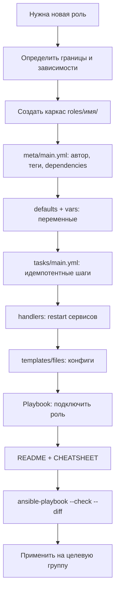

# Подсказка: Создание Ansible-роли с нуля

Эта подсказка (prompt) описывает, как создать новую Ansible-роль в проекте
`homelab-infra/ansible-modular`, следуя сложившимся в репозитории
соглашениям. Используйте её как инструкцию для себя или как промпт для
LLM/коллеги, когда нужно добавить новую роль.

---

## Когда использовать эту подсказку

- Нужна новая роль (например, `nginx`, `firewall`, `etcd`, `patroni` — сейчас
  они лежат как заготовки).
- Хочется, чтобы роль вписывалась в существующую структуру: `tasks/`,
  `handlers/`, `defaults/`, `vars/`, `meta/`, `templates/`, `files/`.
- Важно соблюсти принцип единого источника правды (SSOT) и не дублировать
  уже реализованную логику (Docker, SSH, секреты).

---

## План / сценарий создания роли

### Шаг 1. Определите границы роли (что она ДЕЛАЕТ и чего НЕ делает)

Перед написанием кода ответьте на вопросы:

- Какую одну задачу решает роль? (одна роль = один «рецепт»)
- На каких хостах/группах она применяется? (см. `inventory/`)
- От чего она зависит? (например, `harbor` зависит от `docker`)
- Что уже сделано другими ролями и НЕ должно дублироваться?

> Пример из проекта: роль `harbor` НЕ устанавливает Docker — она объявляет
> зависимость `docker` в `meta/main.yml`. Docker ставится только ролью
> `docker` (SSOT).

### Шаг 2. Создайте каркас роли

```
roles/<имя>/
├── tasks/main.yml      # шаги, которые нужно применить
├── handlers/main.yml   # действия по notify (перезапуск сервисов)
├── defaults/main.yml   # переменные низкого приоритета (безопасно переопределять)
├── vars/main.yml       # переменные высокого приоритета (внутренние для роли)
├── meta/main.yml       # метаданные / зависимости
├── templates/          # Jinja2-шаблоны (.j2)
└── files/              # статические файлы (копируются как есть)
```

Минимально обязательные файлы: `tasks/main.yml` и `meta/main.yml`.
Остальные добавляйте по необходимости.

### Шаг 3. Заполните `meta/main.yml`

Укажите автора, описание, теги и **зависимости**:

```yaml
---
galaxy_info:
  author: gvinogradov
  description: <что делает роль>
  license: gvinogradov
  min_ansible_version: "2.10"
  galaxy_tags:
    - <тег1>
    - <тег2>
dependencies:
  - role: docker        # если нужен Docker
  # - role: common      # если нужна базовая ОС-настройка
```

### Шаг 4. Определите переменные

- **Глобальные** (уже есть, не переопределяйте): `timezone`, `locale`,
  `admin_user`, `bootstrap_user`, `proxmox`, `management_ip` — они в
  `inventory/group_vars/all/main.yml`. Роль ссылается на них напрямую.
- **defaults/main.yml** — значения по умолчанию, которые можно безопасно
  переопределить извне (playbook, group_vars).
- **vars/main.yml** — внутренние значения роли, вычисляемые в рантайме
  (например, зависящие от `ansible_os_family`).
- **Секреты** (пароли, ключи) — НЕ пишите в открытые файлы. Кладите в
  зашифрованный `inventory/group_vars/<group>/vault.yml` и ссылайтесь по
  имени переменной.

### Шаг 5. Напишите `tasks/main.yml`

Рекомендации (на основе `bootstrap` и `docker`):

- Используйте идемпотентные модули (`ansible.builtin.*`): `file`, `copy`,
  `template`, `apt`, `user`, `systemd`, `lineinfile` с `validate`.
- Для конфигов SSH/суда используйте `validate:` (например
  `visudo -cf %s`, `sshd -t -f %s`), чтобы не сломать доступ.
- Для перезапуска сервисов — `notify: <handler>`, а не прямой `systemd`
  в таске (кроме случаев enable/start).
- Используйте `no_log: true` для задач с секретами/ключами.
- Для циклов — `loop:` с проверкой `when: item | length > 0`.
- Для скачивания — `get_url` или `unarchive` с `creates:` (повторный прогон
  не качает заново).
- Для ожидания готовности сервиса — `wait_for` / `uri` с `status_code`.

### Шаг 6. Добавьте `handlers/main.yml`

Только то, что вызывается через `notify`:

```yaml
---
- name: restart <service>
  ansible.builtin.systemd:
    name: <service>
    state: restarted
```

### Шаг 7. Шаблоны и файлы

- `templates/*.j2` — конфиги с переменными Jinja2. Владелец/права задаются
  в таске `template:`.
- `files/` — статические артефакты. Если пусто, оставьте `.gitkeep`.

### Шаг 8. Подключите роль в playbook

В `playbooks/` создайте или дополните playbook:

```yaml
- name: Apply <role> to hosts
  hosts: <group>
  become: true
  roles:
    - <role>
```

Для одноразовых операций (как `bootstrap`) задайте `vars:
ansible_user: "{{ bootstrap_user | default('root') }}"` в playbook, чтобы
достучаться до хоста до появления admin-пользователя.

### Шаг 9. Документируйте роль

Создайте `README.md` (назначение, переменные, handlers, как вызывается) и
опционально `CHEATSHEET.md` (таблица тасков «что/зачем»). Обновите
`roles/README.md`, добавив роль в таблицу статусов.

---

## Что правильно делать (DO)

- [x] Одна роль — одна ответственность.
- [x] Зависимости объявлять в `meta/main.yml`, а не дублировать код.
- [x] Глобальные переменные брать из `group_vars/all`, не копировать.
- [x] Секреты держать в `vault.yml`, не в открытых `defaults/vars`.
- [x] Использовать `validate:` для критичных конфигов (sudo, sshd).
- [x] Делать таски идемпотентными (`creates:`, `state:`, `when:`).
- [x] Писать `README.md` + обновлять сводную таблицу ролей.

## Чего избегать (DON'T)

- [ ] Не устанавливайте Docker/SSH/базовую ОС внутри новой роли, если это
      уже делают `docker` / `bootstrap` / `common`.
- [ ] Не хардкодьте пароли и ключи в `tasks/` или `defaults/`.
- [ ] Не делайте `command:`/`shell:` без `creates:`/`when:`, иначе
      неидемпотентно.
- [ ] Не смешивайте логику нескольких сервисов в одной роли.
- [ ] Не забывайте `no_log: true` для задач с секретами.
- [ ] Не правьте `group_vars/all` ради одной роли — используйте
      `defaults`/`vars` самой роли.

---

## Как правильно управлять ролями

1. **Запуск по группам**: `hosts: net_service` / `all:!hq` — цельтесь
   точно, не применяйте всё ко всем.
2. **Порядок применения**: сначала `bootstrap` (один раз, как root), затем
   `common`, затем сервисные роли (`dns`, `docker`, `harbor`...).
3. **Проверка перед применением**: `ansible-playbook --check --diff`.
4. **Секреты**: `ansible-vault edit inventory/group_vars/<group>/vault.yml`.
5. **Переиспользование**: новая роль, которой нужен Docker, просто пишет
   `dependencies: [{ role: docker }]` — и не тащит установку за собой.
6. **Версионирование**: держите `min_ansible_version` и теги в `meta`.

---

## Mermaid: жизненный цикл создания роли



---

## Пример: минимальная роль «nginx» (заготовка → реализация)

1. `roles/nginx/meta/main.yml` — `dependencies: [{ role: common }]`.
2. `roles/nginx/defaults/main.yml` — `nginx_listen_port: 80`.
3. `roles/nginx/tasks/main.yml` — `apt: name=nginx`, `template:
   sites.j2`, `notify: restart nginx`.
4. `roles/nginx/handlers/main.yml` — `restart nginx` через `systemd`.
5. `playbooks/site.yml` — добавить play `hosts: web, roles: [nginx]`.
6. `roles/README.md` — перевести `nginx` из «заготовка» в «готово».
